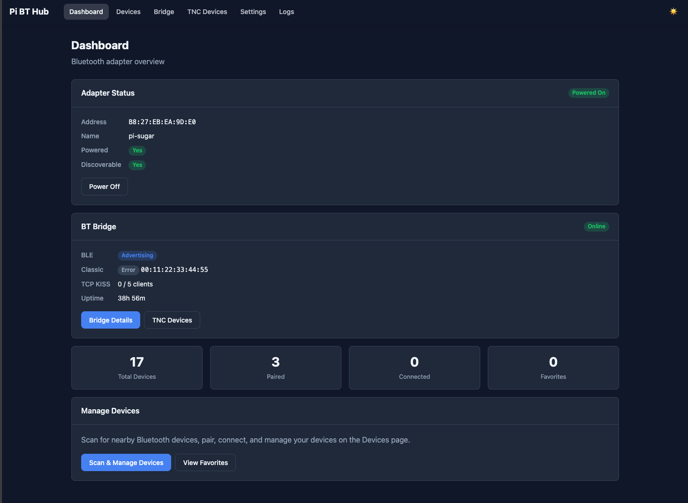
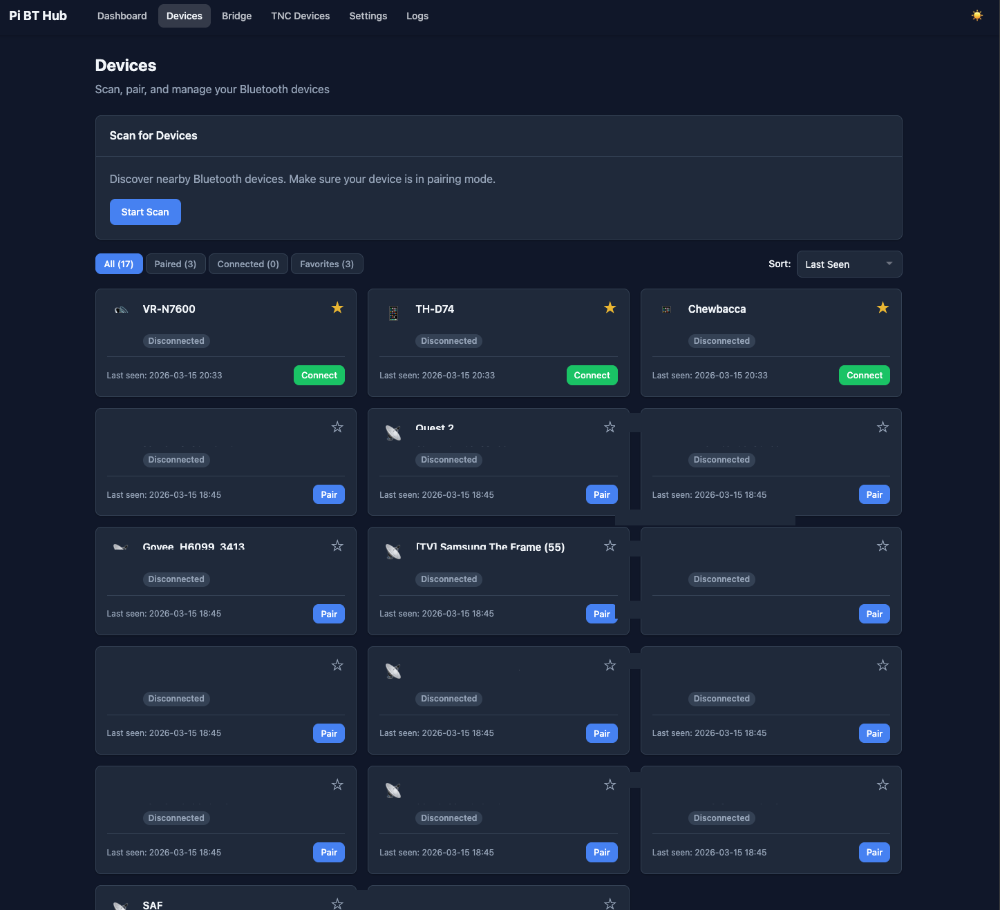
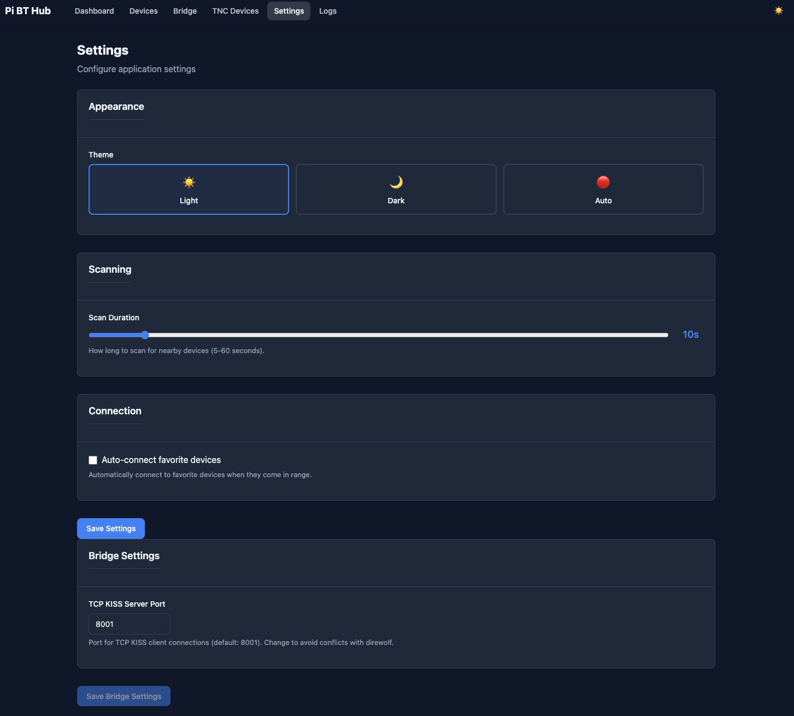
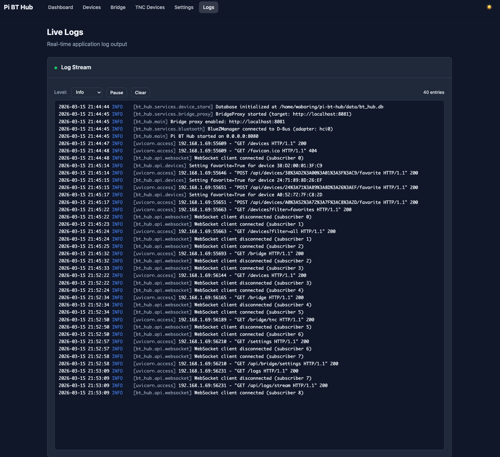

# Pi BT Hub

A web-based Bluetooth management interface for Raspberry Pi, with optional integration for the BT Bridge daemon that bridges Bluetooth LE to Classic Bluetooth for TNC (Terminal Node Controller) devices.



## Features

- **Device Management**: Scan, discover, and manage Bluetooth devices
- **Favorites**: Mark devices as favorites for quick access
- **Ignore List**: Hide unwanted devices from scan results
- **Signal Strength**: Real-time RSSI signal meter with color-coded bars
- **Bridge Integration**: Optional integration with bt-bridge daemon for BLE-to-Classic bridging
- **TCP KISS Server**: Configurable TCP KISS server port to avoid conflicts with direwolf
- **Real-time Updates**: WebSocket-based live updates during scanning
- **Responsive UI**: Works on desktop and mobile browsers

## Requirements

- Raspberry Pi (tested on Pi Zero W, Pi Zero 2 W, Pi 3, Pi 4)
- Raspberry Pi OS (Bookworm or Trixie recommended)
- Python 3.11+
- Bluetooth adapter (built-in or USB)

## Installation

> **Detailed guide**: See [docs/INSTALL.md](docs/INSTALL.md) for complete platform-specific instructions, including piwheels configuration and troubleshooting.

### Automated Install (Recommended)

The installer script handles permissions, rfkill, and dependencies automatically:

```bash
# Clone the repository
git clone https://github.com/hemna/pi-bt-hub.git
cd pi-bt-hub

# Run the installer
./install.sh
```

The installer will:
- Add your user to the `bluetooth` group
- Check and unblock rfkill if Bluetooth is blocked
- Create D-Bus policy for BlueZ access
- Install uv (optional, for faster installs)
- Create a virtual environment and install dependencies
- Optionally create and enable a systemd service

### Quick Install (Raspberry Pi 2/3/4/5 and Pi Zero 2 W)

These boards use armv7l or aarch64 and have pre-built wheels available from [piwheels.org](https://www.piwheels.org/). Installation is straightforward:

```bash
# Clone the repository
git clone https://github.com/hemna/pi-bt-hub.git
cd pi-bt-hub

# Create virtual environment
python3 -m venv .venv
source .venv/bin/activate

# Install dependencies
pip install -r backend/requirements.txt
pip install -e backend/
```

### Raspberry Pi Zero W (armv6l)

The original Pi Zero W uses an armv6l CPU. Most piwheels packages target armv7l and above, so many dependencies must be compiled from source. This is slow (~30-60 minutes) and requires extra swap space. See [docs/INSTALL.md](docs/INSTALL.md) for the full walkthrough.

**Quick summary:**

```bash
# 1. Increase swap to 1GB (required for compilation)
sudo dphys-swapfile swapoff
sudo sed -i 's/CONF_SWAPSIZE=.*/CONF_SWAPSIZE=1024/' /etc/dphys-swapfile
sudo dphys-swapfile setup
sudo dphys-swapfile swapon

# 2. Install build dependencies
sudo apt-get install -y python3-dev libglib2.0-dev

# 3. Clone and set up
git clone https://github.com/hemna/pi-bt-hub.git
cd pi-bt-hub
python3 -m venv .venv
source .venv/bin/activate

# 4. Install packages individually (avoids pip memory issues)
pip install fastapi uvicorn jinja2 aiosqlite httpx python-multipart websockets
pip install pydantic pydantic-settings
pip install dbus-fast  # This one takes longest to compile
pip install --no-deps -e backend/
```

### Using piwheels (Raspberry Pi OS default)

Raspberry Pi OS ships with [piwheels.org](https://www.piwheels.org/) pre-configured in `/etc/pip.conf`. This provides pre-built ARM wheels and dramatically speeds up installs on armv7l and aarch64 boards (Pi Zero 2 W, Pi 3/4/5).

If piwheels is not configured (e.g., you are using a custom OS image), you can add it manually:

```bash
# Check if piwheels is already configured
pip config list

# If not present, add it
sudo tee /etc/pip.conf > /dev/null <<EOF
[global]
extra-index-url=https://www.piwheels.org/simple
EOF
```

> **Note**: piwheels does not provide armv6l wheels. On the original Pi Zero W, packages with C extensions will always be compiled from source regardless of this setting.

## Running

### Development Mode

```bash
source .venv/bin/activate
uvicorn bt_hub.main:app --host 0.0.0.0 --port 8080 --reload
```

### Production (systemd)

Copy the service file and enable it:

```bash
sudo cp systemd/bt-hub.service /etc/systemd/system/
sudo systemctl daemon-reload
sudo systemctl enable bt-hub
sudo systemctl start bt-hub
```

Check status:

```bash
sudo systemctl status bt-hub
sudo journalctl -u bt-hub -f
```

## Configuration

Configuration is done via environment variables. Set these in the systemd service file or export them before running.

| Variable | Default | Description |
|----------|---------|-------------|
| `BT_HUB_HOST` | `0.0.0.0` | Listen address |
| `BT_HUB_PORT` | `8080` | Listen port |
| `BT_HUB_DB_PATH` | `data/bt_hub.db` | SQLite database path |
| `BT_HUB_LOG_LEVEL` | `INFO` | Log level |
| `BT_HUB_BRIDGE_ENABLED` | `false` | Enable bridge integration |
| `BT_HUB_BRIDGE_URL` | `http://localhost:8081` | Bridge daemon URL |

### Systemd Service Configuration

The default service file runs on port 8080 as a regular user. To run on port 80 (standard HTTP), you need to either run as root or grant the capability to bind to privileged ports.

**Option 1: Run as root on port 80**

Edit `/etc/systemd/system/bt-hub.service`:

```ini
[Unit]
Description=Pi BT Hub - Bluetooth Management Web UI
After=network.target bluetooth.target dbus.service
Requires=bluetooth.target dbus.service

[Service]
Type=simple
User=root
Group=root
WorkingDirectory=/home/pi/pi-bt-hub
Environment=PYTHONPATH=/home/pi/pi-bt-hub/src
Environment=BT_HUB_DB_PATH=/home/pi/pi-bt-hub/data/bt_hub.db
ExecStart=/home/pi/pi-bt-hub/.venv/bin/uvicorn bt_hub.main:app --host 0.0.0.0 --port 80
Restart=always
RestartSec=5

[Install]
WantedBy=multi-user.target
```

**Option 2: Run as regular user on port 8080**

```ini
[Unit]
Description=Pi BT Hub - Bluetooth Management Web UI
After=network.target bluetooth.target dbus.service
Requires=bluetooth.target dbus.service

[Service]
Type=simple
User=pi
Group=pi
SupplementaryGroups=bluetooth
WorkingDirectory=/home/pi/pi-bt-hub
Environment=PYTHONPATH=/home/pi/pi-bt-hub/src
Environment=BT_HUB_DB_PATH=/home/pi/pi-bt-hub/data/bt_hub.db
ExecStart=/home/pi/pi-bt-hub/.venv/bin/uvicorn bt_hub.main:app --host 0.0.0.0 --port 8080
Restart=always
RestartSec=5

[Install]
WantedBy=multi-user.target
```

> **Note**: Replace `/home/pi` with your actual home directory (e.g., `/home/waboring`).

## Bridge Integration

Pi BT Hub can integrate with the [bt-bridge](https://github.com/hemna/pi-bt-bridge) daemon to provide a web interface for managing the Bluetooth LE to Classic bridge.

### System Dependencies for bt-bridge

The bt-bridge daemon requires the following system packages to be installed:

```bash
sudo apt-get install -y python3-pip libgirepository1.0-dev python3-gi gir1.2-glib-2.0
```

These packages provide:
- **python3-pip**: Package installer (bt-bridge uses pip for installation)
- **libgirepository1.0-dev**: Development files for GObject introspection
- **python3-gi**: Python bindings for GObject introspection
- **gir1.2-glib-2.0**: GLib introspection data

> **Note**: The pi-bt-hub installer installs these automatically when you enable bridge integration.

### Installing bt-bridge

**Option 1: One-click install from the web UI**

If you've enabled bridge integration, you can install bt-bridge directly from the dashboard:

1. Enable bridge integration during pi-bt-hub installation (answer 'y' when prompted)
2. Open the web UI and go to the dashboard
3. In the "Bridge Service" card, click "Install bt-bridge"
4. Wait for the installation to complete (this may take several minutes on a Pi)
5. Configure bt-bridge by editing `/etc/bt-bridge/config.json`
6. Start the service using the "Start" button

**Option 2: Manual installation**

See the [bt-bridge documentation](https://github.com/hemna/pi-bt-bridge) for manual installation instructions.

### Enabling Bridge Integration

**Option 1: Using the installer (recommended)**

Run the installer and answer "y" when asked about bridge integration:
```bash
./install.sh
# ... answer 'y' to "Enable bt-bridge integration?"
```

This creates a systemd drop-in that:
- Starts bt-bridge.service automatically when pi-bt-hub starts
- Enables bridge integration in the app

**Option 2: Manual systemd configuration**

Create a drop-in override file:
```bash
sudo mkdir -p /etc/systemd/system/pi-bt-hub.service.d
sudo tee /etc/systemd/system/pi-bt-hub.service.d/bridge.conf > /dev/null <<EOF
[Unit]
Wants=bt-bridge.service
After=bt-bridge.service

[Service]
Environment=BT_HUB_BRIDGE_ENABLED=true
Environment=BT_HUB_BRIDGE_URL=http://localhost:8081
EOF

sudo systemctl daemon-reload
sudo systemctl restart pi-bt-hub
```

**Option 3: Environment variables / .env file**

1. Install and configure bt-bridge daemon (see bt-bridge documentation)
2. Set `BT_HUB_BRIDGE_ENABLED=true` in your environment or `.env` file
3. Set `BT_HUB_BRIDGE_URL` to point to your bridge daemon (default: `http://localhost:8081`)
4. Restart bt-hub

### Bridge Features

When bridge integration is enabled, the UI provides:

- **Bridge Status**: Real-time status of BLE and Classic Bluetooth connections
- **Service Control**: Start, stop, restart bt-bridge.service from the dashboard
- **Service Logs**: View recent journalctl logs for the bridge service
- **TNC Management**: Add, edit, and remove TNC devices from history
- **Connection Control**: Connect/disconnect from TNC devices
- **TCP KISS Server**: Configure the TCP KISS server port

### Bridge Service Control

The dashboard provides controls to start/stop/restart the bt-bridge systemd service directly from the web UI. This requires sudoers configuration to allow the pi-bt-hub user to run systemctl commands without a password.

**Automatic setup (recommended):**

The installer configures this automatically when you enable bridge integration:
```bash
./install.sh
# Answer 'y' to "Enable bt-bridge integration?"
```

**Manual setup:**

Create `/etc/sudoers.d/pi-bt-hub`:
```bash
sudo tee /etc/sudoers.d/pi-bt-hub > /dev/null <<EOF
# Pi BT Hub - allow bt-bridge service control without password
<your-user> ALL=(root) NOPASSWD: /bin/systemctl start bt-bridge.service
<your-user> ALL=(root) NOPASSWD: /bin/systemctl stop bt-bridge.service
<your-user> ALL=(root) NOPASSWD: /bin/systemctl restart bt-bridge.service
<your-user> ALL=(root) NOPASSWD: /bin/systemctl status bt-bridge.service
<your-user> ALL=(root) NOPASSWD: /bin/systemctl is-active bt-bridge.service
<your-user> ALL=(root) NOPASSWD: /bin/systemctl is-enabled bt-bridge.service
<your-user> ALL=(root) NOPASSWD: /bin/systemctl show bt-bridge.service *
<your-user> ALL=(root) NOPASSWD: /bin/journalctl -u bt-bridge.service *

# bt-bridge installation (one-click install from web UI)
<your-user> ALL=(root) NOPASSWD: /tmp/bt-bridge-install-wrapper.sh
EOF

sudo chmod 440 /etc/sudoers.d/pi-bt-hub
```

Replace `<your-user>` with the username running pi-bt-hub (e.g., `pi` or `waboring`).

### TCP KISS Server Port

The bridge daemon runs a TCP KISS server that allows applications (like direwolf or APRS clients) to connect. By default, it listens on port 8001.

If you're running direwolf on the same host (which also defaults to port 8001), you'll need to change one of them. To change the bridge's TCP KISS port:

1. Go to **Settings** in the web UI
2. Find the **Bridge Settings** section
3. Change the **TCP KISS Server Port** to a different port (e.g., 8002)
4. Click **Save Bridge Settings**
5. Confirm the restart when prompted

The bridge will automatically restart with the new port.

## Web Interface

Access the web interface at `http://<pi-address>:8080` (or port 80 if configured)

### Pages

- **Dashboard** (`/`): Overview with quick actions and bridge status
- **Devices** (`/devices`): Scan, pair, and manage Bluetooth devices with favorites, ignore list, and signal strength display
- **Bridge** (`/bridge`): Bridge status and TNC connection management (when enabled)
- **TNC Devices** (`/bridge/tnc`): Manage TNC device history (when enabled)
- **Settings** (`/settings`): Configure app and bridge settings
- **Logs** (`/logs`): View application logs

### Screenshots

#### Devices
Scan for nearby Bluetooth devices, pair, connect, and mark favorites.



#### Settings
Configure theme, scan duration, auto-connect behavior, and bridge TCP KISS port.



#### Live Logs
Real-time streaming application logs with level filtering.



## Troubleshooting

### Scan not showing devices

1. Check Bluetooth adapter is powered on:
   ```bash
   bluetoothctl show
   ```

2. Check bt-hub logs:
   ```bash
   sudo journalctl -u bt-hub -f
   ```

3. Ensure websockets is installed (included in requirements.txt):
   ```bash
   pip install websockets
   sudo systemctl restart bt-hub
   ```

### Bridge not connecting

1. Check bt-bridge daemon is running:
   ```bash
   sudo systemctl status bt-bridge
   ```

2. Verify bridge URL is correct in bt-hub config

3. Check bridge logs:
   ```bash
   sudo journalctl -u bt-bridge -f
   ```

### Permission errors

Pi BT Hub needs permission to control the Bluetooth adapter via D-Bus. If you see errors like `org.bluez.Error.Failed` when trying to power on the adapter or perform other operations:

**1. Add your user to the `bluetooth` group:**

```bash
sudo usermod -aG bluetooth $USER
# Log out and back in for changes to take effect
```

**2. Verify group membership:**

```bash
groups
# Should include 'bluetooth'
```

**3. If running as a systemd service**, ensure the service user has the correct groups. Edit the service file:

```ini
[Service]
User=pi
Group=pi
SupplementaryGroups=bluetooth
```

Then reload and restart:

```bash
sudo systemctl daemon-reload
sudo systemctl restart bt-hub
```

### Bluetooth adapter won't power on

If the adapter status shows "Powered Off" and clicking "Power On" fails with a BlueZ error, the adapter may be blocked by rfkill:

**1. Check rfkill status:**

```bash
sudo rfkill list bluetooth
```

If you see `Soft blocked: yes`, the adapter is software-blocked.

**2. Unblock Bluetooth:**

```bash
sudo rfkill unblock bluetooth
```

**3. Verify it's unblocked:**

```bash
sudo rfkill list bluetooth
# Should show:
#   Soft blocked: no
#   Hard blocked: no
```

**4. Make it persistent across reboots** by adding to `/etc/rc.local` or creating a systemd service:

```bash
# Option A: Add to /etc/rc.local (before 'exit 0')
/usr/sbin/rfkill unblock bluetooth

# Option B: Create a systemd service
sudo tee /etc/systemd/system/rfkill-unblock-bluetooth.service > /dev/null <<EOF
[Unit]
Description=Unblock Bluetooth adapter
Before=bluetooth.service

[Service]
Type=oneshot
ExecStart=/usr/sbin/rfkill unblock bluetooth
RemainAfterExit=yes

[Install]
WantedBy=multi-user.target
EOF

sudo systemctl enable rfkill-unblock-bluetooth
```

### D-Bus permission denied

If you see D-Bus permission errors in the logs, you may need to add a custom D-Bus policy. Create `/etc/dbus-1/system.d/pi-bt-hub.conf`:

```xml
<!DOCTYPE busconfig PUBLIC "-//freedesktop//DTD D-BUS Bus Configuration 1.0//EN"
 "http://www.freedesktop.org/standards/dbus/1.0/busconfig.dtd">
<busconfig>
  <policy group="bluetooth">
    <allow send_destination="org.bluez"/>
    <allow send_interface="org.freedesktop.DBus.ObjectManager"/>
    <allow send_interface="org.freedesktop.DBus.Properties"/>
  </policy>
</busconfig>
```

Then reload D-Bus:

```bash
sudo systemctl reload dbus
```

## License

MIT License - see LICENSE file for details.
